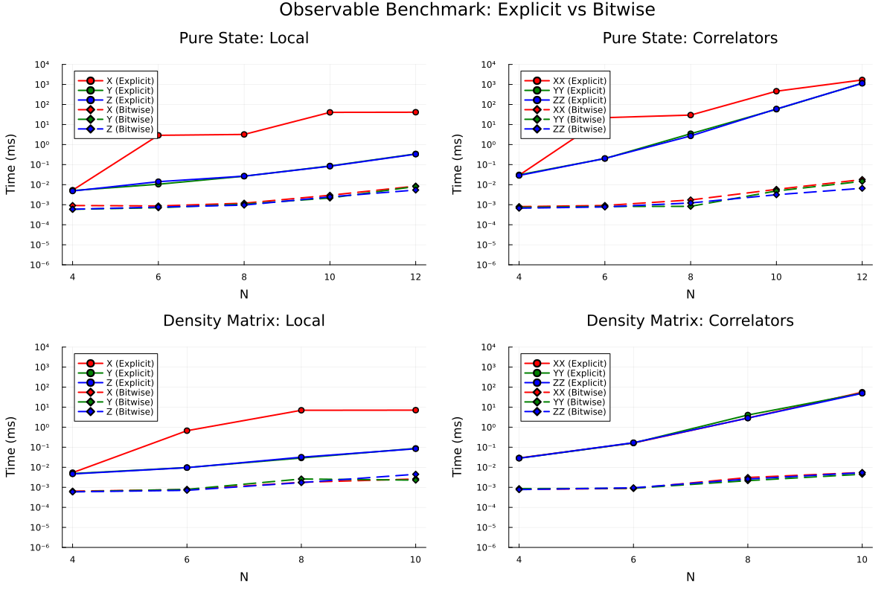
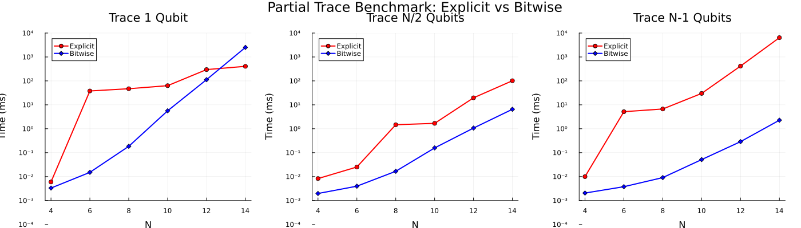

# FastObservables.jl

[](https://julialang.org/)
[](https://opensource.org/licenses/MIT)

**Bitwise Quantum Observable Calculations for Pure States and Density Matrices**

> **Author:** Marcin Płodzień  
> **Date:** January 2026

---

## Benchmark

This code implements calculation of expectation values of single- and two-qubit Pauli strings observables, using bitwise index manipulation, avoiding explicit construction of $2^N \times 2^N$ operator matrices. Runtime is compared against QuantumOptics.jl, which uses standard tensor product methods.

<p align="center">
  
</p>

<p align="center">
  
</p>

---

## Table of Contents

- [Overview](#overview)
- [Key Features](#key-features)
- [Installation](#installation)
- [Quick Start](#quick-start)
- [Mathematical Foundations](#mathematical-foundations)
  - [Bit Convention](#bit-convention-critical)
  - [Pure State Observables](#pure-state-observables)
  - [Density Matrix Observables](#density-matrix-observables)
  - [Two-Body Correlators](#two-body-correlators)
  - [Partial Trace](#partial-trace)
- [API Reference](#api-reference)
- [Benchmark Results](#benchmark-results)
- [Project Structure](#project-structure)
- [Tutorial Document](#tutorial-document)
- [JAX Implementation](#jax-implementation)
- [Contributing](#contributing)
- [License](#license)

---

## Overview

Standard quantum simulation libraries compute expectation values by constructing the full N-qubit operator as a $2^N \times 2^N$ matrix. This approach has $O(4^N)$ memory and time complexity for operator construction.

This implementation exploits the structure of Pauli operators in the computational basis:

- $Z_k$ is diagonal: $Z_k|s\rangle = (-1)^{s_k}|s\rangle$
- $X_k$ flips bit k: $X_k|s\rangle = |s \oplus 2^{k-1}\rangle$
- $Y_k$ combines both: $Y_k|s\rangle = i(-1)^{s_k}|s \oplus 2^{k-1}\rangle$

Using bitwise operations (shifts, AND, XOR), expectation values are computed in $O(2^N)$ time without matrix construction.

---

## Features

- Pure state observables: local X, Y, Z and two-body correlators XX, YY, ZZ
- Density matrix observables: trace-based expectation values
- Partial trace: reduced density matrix computation
- QuantumOptics.jl compatible: little-endian bit convention
- Numerical validation: machine-precision agreement with explicit methods  

---

## Installation

### Clone and Run

```bash
git clone https://github.com/your-repo/FastObservables.git
cd FastObservables

# Install dependencies
julia -e 'using Pkg; Pkg.activate("."); Pkg.instantiate()'

# Run the benchmark
julia --project=. run_benchmark.jl
```

### Include as a Module

```julia
include("FastObservables.jl")
using .FastObservables
```

### Dependencies

- **Julia 1.9+**
- `LinearAlgebra` (stdlib)
- `Printf` (stdlib)
- `Dates` (stdlib)
- `QuantumOptics.jl` (for benchmarking comparison)
- `Plots.jl` (for visualization)

---

## Quick Start

### Basic Usage

```julia
using LinearAlgebra
include("FastObservables.jl")
using .FastObservables

# Create a random 4-qubit pure state
N = 4
ψ = randn(ComplexF64, 2^N)
ψ ./= norm(ψ)

# Compute local observables
z1 = expect_local(ψ, 1, N, :z)  # ⟨Z₁⟩
x2 = expect_local(ψ, 2, N, :x)  # ⟨X₂⟩
y3 = expect_local(ψ, 3, N, :y)  # ⟨Y₃⟩

# Compute two-body correlators
zz12 = expect_corr(ψ, 1, 2, N, :zz)  # ⟨Z₁Z₂⟩
xx23 = expect_corr(ψ, 2, 3, N, :xx)  # ⟨X₂X₃⟩
yy14 = expect_corr(ψ, 1, 4, N, :yy)  # ⟨Y₁Y₄⟩

# Compute reduced density matrix (trace out qubits 3 and 4)
ρ_12 = fast_ptrace(ψ, [1, 2], N)

println("⟨Z₁⟩ = $z1")
println("⟨Z₁Z₂⟩ = $zz12")
println("ρ₁₂ size: $(size(ρ_12))")
```

### Density Matrix Observables

```julia
# Create density matrix from pure state
ρ = Matrix(ψ * ψ')

# Compute observables on density matrix
z1_dm = expect_local_dm(ρ, 1, N, :z)  # Tr(Z₁ρ)
xx12_dm = expect_corr_dm(ρ, 1, 2, N, :xx)  # Tr(X₁X₂ρ)
```

### Canonical Quantum States

```julia
# Bell state: (|00⟩ + |11⟩)/√2
ψ_bell = zeros(ComplexF64, 4)
ψ_bell[1] = 1/√2  # |00⟩
ψ_bell[4] = 1/√2  # |11⟩

expect_corr(ψ_bell, 1, 2, 2, :zz)  # → 1.0 (maximally correlated)
expect_corr(ψ_bell, 1, 2, 2, :xx)  # → 1.0
expect_corr(ψ_bell, 1, 2, 2, :yy)  # → -1.0

# GHZ state: (|000⟩ + |111⟩)/√2
ψ_ghz = zeros(ComplexF64, 8)
ψ_ghz[1] = 1/√2  # |000⟩
ψ_ghz[8] = 1/√2  # |111⟩

# W state: (|001⟩ + |010⟩ + |100⟩)/√3
ψ_w = zeros(ComplexF64, 8)
ψ_w[2] = 1/√3  # |001⟩
ψ_w[3] = 1/√3  # |010⟩
ψ_w[5] = 1/√3  # |100⟩
```

---

## Mathematical Foundations

### Bit Convention (Critical!)

We use **Little-Endian (LSB-Fast)** bit ordering, consistent with QuantumOptics.jl:

| Qubit | Bit Position | Mask |
|-------|--------------|------|
| Qubit 1 | bit 0 (LSB) | `1 << 0 = 1` |
| Qubit 2 | bit 1 | `1 << 1 = 2` |
| Qubit k | bit k-1 | `1 << (k-1)` |
| Qubit N | bit N-1 (MSB) | `1 << (N-1)` |

**State Vector Indexing:**

The basis state |qₙ qₙ₋₁ ... q₂ q₁⟩ maps to index:

$$\text{index} = q_1 \times 2^0 + q_2 \times 2^1 + \cdots + q_N \times 2^{N-1}$$

**Example for N=3 qubits:**

| State | Binary | Index |
|-------|--------|-------|
| \|000⟩ | 000 | 0 |
| \|001⟩ | 001 | 1 ← qubit 1 is \|1⟩ |
| \|010⟩ | 010 | 2 ← qubit 2 is \|1⟩ |
| \|011⟩ | 011 | 3 |
| \|100⟩ | 100 | 4 ← qubit 3 is \|1⟩ |
| \|101⟩ | 101 | 5 |
| \|110⟩ | 110 | 6 |
| \|111⟩ | 111 | 7 |

**Extracting Qubit k from Index i:**

```julia
bit_k = (i >> (k-1)) & 1
```

---

### Pure State Observables

For a pure state $|\psi\rangle = \sum_i \psi_i |i\rangle$, the expectation value of an observable $O$ is:

$$\langle O \rangle = \langle\psi|O|\psi\rangle = \sum_{i,j} \psi_i^* \langle i|O|j\rangle \psi_j$$

#### Z Observable

The Pauli-Z operator is **diagonal** in the computational basis with eigenvalues ±1:

$$Z_k |s\rangle = (-1)^{s_k} |s\rangle$$

where $s_k \in \{0, 1\}$ is the value of qubit k. Since Z is diagonal, the matrix element $\langle i|Z_k|j\rangle = (-1)^{\text{bit}_k(i)} \delta_{ij}$.

**Derivation:**

$$\langle Z_k \rangle = \sum_{i,j} \psi_i^* (-1)^{\text{bit}_k(i)} \delta_{ij} \psi_j = \sum_i |\psi_i|^2 (-1)^{\text{bit}_k(i)}$$

Using the identity $(-1)^b = 1 - 2b$ for $b \in \{0,1\}$:

$$\langle Z_k \rangle = \sum_i |\psi_i|^2 (1 - 2 \times \text{bit}_k(i))$$

**Bitwise implementation:**
```julia
bit_pos = k - 1  # Little-endian: qubit 1 = bit 0
for i in 0:(2^N - 1)
    bit_k = (i >> bit_pos) & 1   # Extract bit k from index i
    sign = 1 - 2*bit_k           # Map {0,1} → {+1,-1}
    result += abs2(ψ[i+1]) * sign
end
```

**Complexity:** O(2ᴺ) single loop, no matrix construction.

#### X Observable

The Pauli-X operator **flips** bit k:

$$X_k |s_k = 0\rangle = |s_k = 1\rangle, \quad X_k |s_k = 1\rangle = |s_k = 0\rangle$$

The flipped state has index $i \oplus 2^{k-1}$ where $\oplus$ is XOR. The matrix element:

$$\langle i|X_k|j\rangle = \delta_{i, j \oplus 2^{k-1}}$$

**Derivation:**

$$\langle X_k \rangle = \sum_{i,j} \psi_i^* \delta_{i, j \oplus \text{step}} \psi_j = \sum_j \psi_{j \oplus \text{step}}^* \psi_j$$

where $\text{step} = 2^{k-1}$. Pairing states where bit k is 0 with their partners where bit k is 1:

$$\langle X_k \rangle = \sum_{i: b_k = 0} \left( \psi_i^* \psi_{i+\text{step}} + \psi_{i+\text{step}}^* \psi_i \right) = 2 \times \text{Re}\left( \sum_{i: b_k = 0} \psi_i^* \psi_{i+\text{step}} \right)$$

**Bitwise implementation:**
```julia
step = 1 << bit_pos  # step = 2^(k-1)
for i in 0:(2^N - 1)
    if ((i >> bit_pos) & 1) == 0  # Only process when bit k = 0
        result += 2 * real(conj(ψ[i+1]) * ψ[i+step+1])
    end
end
```

**Complexity:** O(2ᴺ⁻¹) loop over states where bit k is 0.

#### Y Observable

The Pauli-Y operator combines flip and phase:

$$Y_k |s_k = 0\rangle = i|s_k = 1\rangle, \quad Y_k |s_k = 1\rangle = -i|s_k = 0\rangle$$

**Derivation:**

$$\langle Y_k \rangle = \sum_{i: b_k = 0} \left[ \psi_i^* (i \psi_{i+\text{step}}) + \psi_{i+\text{step}}^* (-i \psi_i) \right]$$

$$= i \sum_{i: b_k = 0} \left[ \psi_i^* \psi_{i+\text{step}} - \psi_{i+\text{step}}^* \psi_i \right]$$

$$= i \times 2i \times \text{Im}(\psi_i^* \psi_{i+\text{step}}) = 2 \times \text{Im}\left( \sum_{i: b_k = 0} \psi_i^* \psi_{i+\text{step}} \right)$$

**Bitwise implementation:**
```julia
for i in 0:(2^N - 1)
    if ((i >> bit_pos) & 1) == 0
        result += 2 * imag(conj(ψ[i+1]) * ψ[i+step+1])
    end
end
```

---

### Density Matrix Observables

For a density matrix $\rho$, the expectation value of observable $O$ is:

$$\langle O \rangle = \text{Tr}(O \rho) = \sum_{i,j} O_{ij} \rho_{ji} = \sum_i \langle i|O\rho|i\rangle$$

**Key insight:** Pauli matrices are sparse with at most one non-zero element per row, so only specific elements of $\rho$ contribute.

#### Z Observable (Density Matrix)

Since $Z_k$ is diagonal with $\langle i|Z_k|j\rangle = (-1)^{\text{bit}_k(i)} \delta_{ij}$:

**Derivation:**

$$\text{Tr}(Z_k \rho) = \sum_{i,j} (Z_k)_{ij} \rho_{ji} = \sum_i (Z_k)_{ii} \rho_{ii} = \sum_i (-1)^{\text{bit}_k(i)} \rho_{ii}$$

Only the **diagonal elements** of $\rho$ contribute.

**Bitwise implementation:**
```julia
for i in 0:(dim-1)
    sign = 1 - 2 * ((i >> bit_k) & 1)
    result += real(ρ[i+1, i+1]) * sign
end
```

#### X Observable (Density Matrix)

The matrix elements of $X_k$ are: $(X_k)_{ij} = \delta_{i, j \oplus \text{step}}$ where $\text{step} = 2^{k-1}$.

**Derivation:**

$$\text{Tr}(X_k \rho) = \sum_{i,j} (X_k)_{ij} \rho_{ji} = \sum_i \rho_{i \oplus \text{step}, i}$$

Pairing indices where bit k is 0 with their partners:

$$= \sum_{i: b_k = 0} \left[ \rho_{i+\text{step}, i} + \rho_{i, i+\text{step}} \right]$$

Since $\rho$ is Hermitian ($\rho_{ji} = \rho_{ij}^*$):

$$= 2 \times \sum_{i: b_k = 0} \text{Re}(\rho_{i, i+\text{step}})$$

**Bitwise implementation:**
```julia
for i in 0:(dim-1)
    if ((i >> bit_k) & 1) == 0
        result += 2 * real(ρ[i+1, i+step+1])
    end
end
```

#### Y Observable (Density Matrix)

The matrix elements of $Y_k$ are: $(Y_k)_{ij} = i \cdot \delta_{i, j+\text{step}}$ for $b_k(j)=0$, and $-i \cdot \delta_{i, j-\text{step}}$ for $b_k(j)=1$.

**Derivation:**

$$\text{Tr}(Y_k \rho) = \sum_{i: b_k = 0} \left[ i \cdot \rho_{i+\text{step}, i} + (-i) \cdot \rho_{i, i+\text{step}} \right]$$

$$= i \sum_{i: b_k = 0} \left[ \rho_{i+\text{step}, i} - \rho_{i, i+\text{step}} \right]$$

Using Hermiticity: $\rho_{i+\text{step}, i} - \rho_{i, i+\text{step}} = 2i \cdot \text{Im}(\rho_{i+\text{step}, i})$

$$= 2 \times \sum_{i: b_k = 0} \text{Im}(\rho_{i+\text{step}, i})$$

**Bitwise implementation:**
```julia
for i in 0:(dim-1)
    if ((i >> bit_k) & 1) == 0
        result += 2 * imag(ρ[i+step+1, i+1])
    end
end
```

#### ZZ Correlator (Density Matrix)

Since $Z_i Z_j$ is diagonal:

$$\text{Tr}(Z_i Z_j \rho) = \sum_s \rho_{ss} (-1)^{b_i(s) \oplus b_j(s)} = \sum_s \rho_{ss} (1 - 2(b_i \oplus b_j))$$

**Bitwise implementation:**
```julia
for s in 0:(dim-1)
    bi = (s >> bit_i) & 1
    bj = (s >> bit_j) & 1
    sign = 1 - 2 * (bi ⊻ bj)
    result += real(ρ[s+1, s+1]) * sign
end
```

#### XX Correlator (Density Matrix)

$X_i X_j$ connects 4-state groups. Using the trace formula:

$$\text{Tr}(X_i X_j \rho) = \sum_{s: b_i = b_j = 0} \left[ \rho_{00, 11} + \rho_{11, 00} + \rho_{01, 10} + \rho_{10, 01} \right]$$

where subscripts denote the values of bits i and j.

**Bitwise implementation:**
```julia
for s in 0:(dim-1)
    if ((s >> bit_i) & 1) == 0 && ((s >> bit_j) & 1) == 0
        s_00, s_01 = s, s + step_j
        s_10, s_11 = s + step_i, s + step_i + step_j
        result += real(ρ[s_00+1, s_11+1]) + real(ρ[s_11+1, s_00+1])
        result += real(ρ[s_01+1, s_10+1]) + real(ρ[s_10+1, s_01+1])
    end
end
```

#### YY Correlator (Density Matrix)

Using the phase rules $YY|00\rangle = -|11\rangle$, $YY|01\rangle = +|10\rangle$:

$$\text{Tr}(Y_i Y_j \rho) = \sum_{s: b_i = b_j = 0} \left[ -\rho_{00, 11} - \rho_{11, 00} + \rho_{01, 10} + \rho_{10, 01} \right]$$

$$= -2 \times \text{Re}(\rho_{00, 11}) + 2 \times \text{Re}(\rho_{01, 10})$$

**Bitwise implementation:**
```julia
for s in 0:(dim-1)
    if ((s >> bit_i) & 1) == 0 && ((s >> bit_j) & 1) == 0
        s_00, s_01 = s, s + step_j
        s_10, s_11 = s + step_i, s + step_i + step_j
        result += -2 * real(ρ[s_00+1, s_11+1])
        result += +2 * real(ρ[s_01+1, s_10+1])
    end
end
```

---

### Two-Body Correlators (Pure State)

#### ZZ Correlator

The product $Z_i Z_j$ is diagonal with eigenvalues determined by the XOR of bits:

$$Z_i Z_j |s\rangle = (-1)^{s_i} (-1)^{s_j} |s\rangle = (-1)^{s_i \oplus s_j} |s\rangle$$

where $\oplus$ is XOR (0 if bits are equal, 1 if different).

**Derivation:**

$$\langle Z_i Z_j \rangle = \sum_s |\psi_s|^2 (-1)^{b_i(s) \oplus b_j(s)} = \sum_s |\psi_s|^2 (1 - 2(b_i(s) \oplus b_j(s)))$$

**Bitwise implementation:**
```julia
for s in 0:(2^N - 1)
    bi = (s >> bit_i) & 1  # Extract bit i
    bj = (s >> bit_j) & 1  # Extract bit j
    sign = 1 - 2*(bi ⊻ bj) # XOR → sign: {same→+1, different→-1}
    result += abs2(ψ[s+1]) * sign
end
```

**Physical interpretation:**
- $\langle ZZ\rangle = +1$: Qubits perfectly correlated (both $|00\rangle$ or $|11\rangle$)
- $\langle ZZ\rangle = -1$: Qubits perfectly anti-correlated ($|01\rangle$ or $|10\rangle$)
- $\langle ZZ\rangle = 0$: No classical correlation

**Example (Bell state):** For $|\psi\rangle = (|00\rangle + |11\rangle)/\sqrt{2}$:
$$\langle ZZ\rangle = \frac{1}{2}(+1) + \frac{1}{2}(+1) = 1$$

#### XX Correlator

$X_i X_j$ flips **both** bits i and j simultaneously. The Hilbert space partitions into 4-state groups:

$$|00_{ij}\rangle \xleftrightarrow{XX} |11_{ij}\rangle, \quad |01_{ij}\rangle \xleftrightarrow{XX} |10_{ij}\rangle$$

**Matrix elements:**
$$\langle 00|XX|11\rangle = 1, \quad \langle 11|XX|00\rangle = 1$$
$$\langle 01|XX|10\rangle = 1, \quad \langle 10|XX|01\rangle = 1$$

**Derivation:** Summing over all 4-state groups:

$$\langle XX\rangle = \sum_{s: b_i = b_j = 0} \left[ \psi_{00}^* \psi_{11} + \psi_{11}^* \psi_{00} + \psi_{01}^* \psi_{10} + \psi_{10}^* \psi_{01} \right]$$

$$= 2 \times \text{Re}\left( \sum_{s: b_i = b_j = 0} \psi_{00}^* \psi_{11} + \psi_{01}^* \psi_{10} \right)$$

**Bitwise implementation:**
```julia
for s in 0:(2^N - 1)
    if ((s >> bit_i) & 1) == 0 && ((s >> bit_j) & 1) == 0
        s_00 = s
        s_01 = s + step_j
        s_10 = s + step_i
        s_11 = s + step_i + step_j
        result += 2 * real(conj(ψ[s_00+1]) * ψ[s_11+1])  # |00⟩↔|11⟩
        result += 2 * real(conj(ψ[s_01+1]) * ψ[s_10+1])  # |01⟩↔|10⟩
    end
end
```

**Complexity:** O(2ᴺ⁻²) loop over states where both bits are 0.

#### YY Correlator

Using the phase rules for Y: $Y|0\rangle = i|1\rangle$, $Y|1\rangle = -i|0\rangle$

**Matrix elements within each 4-state group:**
$$YY|00\rangle = (i)(i)|11\rangle = -|11\rangle \Rightarrow \langle 00|YY|11\rangle = -1$$
$$YY|01\rangle = (i)(-i)|10\rangle = +|10\rangle \Rightarrow \langle 01|YY|10\rangle = +1$$
$$YY|10\rangle = (-i)(i)|01\rangle = +|01\rangle \Rightarrow \langle 10|YY|01\rangle = +1$$
$$YY|11\rangle = (-i)(-i)|00\rangle = -|00\rangle \Rightarrow \langle 11|YY|00\rangle = -1$$

**Result:**

$$\langle YY\rangle = \sum_{s: b_i = b_j = 0} \left[ -\psi_{00}^* \psi_{11} - \psi_{11}^* \psi_{00} + \psi_{01}^* \psi_{10} + \psi_{10}^* \psi_{01} \right]$$

$$= -2 \times \text{Re}(\psi_{00}^* \psi_{11}) + 2 \times \text{Re}(\psi_{01}^* \psi_{10})$$

---

### Partial Trace

The partial trace computes the reduced density matrix of a subsystem by "tracing out" the degrees of freedom of the environment.

#### Mathematical Definition

For a composite system $\mathcal{H} = \mathcal{H}_A \otimes \mathcal{H}_B$, the partial trace over B is defined as:

$$\rho_A = \text{Tr}_B(\rho) = \sum_{b} \langle b | \rho | b \rangle$$

where $\{|b\rangle\}$ is an orthonormal basis for $\mathcal{H}_B$.

#### Index Decomposition

Each computational basis state index $i$ can be decomposed into contributions from "keep" (A) and "trace" (B) qubits:

$$i = i_A \oplus i_B$$

where:
- $i_A$ contains the bits at positions corresponding to kept qubits (with traced bits set to 0)
- $i_B$ contains the bits at positions corresponding to traced qubits (with kept bits set to 0)

**Bit mapping:** For kept qubits at positions $\{k_1, k_2, \ldots, k_{N_A}\}$ and traced qubits at positions $\{t_1, t_2, \ldots, t_{N_B}\}$:

$$i_A = \sum_{m=1}^{N_A} b_{k_m}(i) \cdot 2^{k_m-1}, \qquad i_B = \sum_{m=1}^{N_B} b_{t_m}(i) \cdot 2^{t_m-1}$$

---

#### Partial Trace from Pure State

For a pure state $|\psi\rangle = \sum_i \psi_i |i\rangle$, the full density matrix is $\rho = |\psi\rangle\langle\psi|$.

**Derivation:**

The reduced density matrix element $(i_A, j_A)$ is:

$$(\rho_A)_{i_A, j_A} = \sum_{b} \langle i_A, b | \rho | j_A, b \rangle = \sum_{b} \langle i_A, b | \psi \rangle \langle \psi | j_A, b \rangle$$

$$= \sum_{b} \psi_{i_A | b} \cdot \psi_{j_A | b}^*$$

where $|i_A, b\rangle$ denotes the full state with kept qubits in configuration $i_A$ and traced qubits in configuration $b$, and the full index is computed by combining the bit contributions from kept and traced configurations.

**Lookup table optimization:**

Precompute two tables to avoid repeated bit manipulation:
1. `keep_to_full[k]`: Full index contribution from kept configuration $k$
2. `trace_to_full[t]`: Full index contribution from traced configuration $t$

The full index is then: `full_index = keep_to_full[i_A] | trace_to_full[b]`

**Bitwise implementation (pure state):**
```julia
function fast_ptrace(ψ::Vector{ComplexF64}, keep_indices::Vector{Int}, N::Int)
    N_keep = length(keep_indices)
    N_trace = N - N_keep
    dim_keep = 1 << N_keep
    dim_trace = 1 << N_trace
    
    # Compute traced indices (complement of keep_indices)
    trace_indices = setdiff(1:N, keep_indices)
    
    # 0-indexed bit positions
    keep_bits = [k - 1 for k in keep_indices]
    trace_bits = [k - 1 for k in trace_indices]
    
    # Precompute lookup: trace_idx → partial full_idx
    trace_to_full = Vector{Int}(undef, dim_trace)
    for t in 0:(dim_trace-1)
        idx = 0
        for (bit_idx, full_bit) in enumerate(trace_bits)
            if (t >> (bit_idx - 1)) & 1 == 1
                idx |= (1 << full_bit)
            end
        end
        trace_to_full[t+1] = idx
    end
    
    # Precompute lookup: keep_idx → partial full_idx
    keep_to_full = Vector{Int}(undef, dim_keep)
    for k in 0:(dim_keep-1)
        idx = 0
        for (bit_idx, full_bit) in enumerate(keep_bits)
            if (k >> (bit_idx - 1)) & 1 == 1
                idx |= (1 << full_bit)
            end
        end
        keep_to_full[k+1] = idx
    end
    
    # Build reduced density matrix
    ρ = zeros(ComplexF64, dim_keep, dim_keep)
    
    for i_keep in 0:(dim_keep-1)
        i_base = keep_to_full[i_keep+1]
        for j_keep in 0:(dim_keep-1)
            j_base = keep_to_full[j_keep+1]
            val = zero(ComplexF64)
            
            # Sum over traced configurations (same for both indices)
            for t in 0:(dim_trace-1)
                t_contrib = trace_to_full[t+1]
                i_full = i_base | t_contrib
                j_full = j_base | t_contrib
                val += ψ[i_full + 1] * conj(ψ[j_full + 1])
            end
            
            ρ[i_keep + 1, j_keep + 1] = val
        end
    end
    
    return ρ
end
```

**Complexity:**
- Time: $O(2^{2 N_A} \times 2^{N_B})$ where $N_A$ = kept qubits, $N_B$ = traced qubits
- Space: $O(2^{2 N_A})$ for the reduced density matrix + $O(2^{N_A} + 2^{N_B})$ for lookup tables

---

#### Partial Trace from Density Matrix

For a general density matrix $\rho$ (not necessarily pure), the partial trace is:

$$(\rho_A)_{i_A, j_A} = \sum_{b} \rho_{(i_A|b), (j_A|b)}$$

where $(i_A|b)$ denotes the full index with kept qubits in configuration $i_A$ and traced qubits in configuration $b$.

**Key difference from pure state:** We sum over diagonal elements in the traced subspace of the full density matrix, reading directly from $\rho$.

**Derivation:**

Starting from the definition of partial trace:

$$\text{Tr}_B(\rho) = \sum_{b} (I_A \otimes \langle b|) \rho (I_A \otimes |b\rangle)$$

The matrix element:

$$(\rho_A)_{i_A, j_A} = \sum_{b} \langle i_A | \otimes \langle b| \rho |j_A \rangle \otimes |b\rangle = \sum_{b} \rho_{(i_A, b), (j_A, b)}$$

**Bitwise implementation (density matrix):**
```julia
function fast_ptrace(ρ::Matrix{ComplexF64}, keep_indices::Vector{Int}, N::Int)
    N_keep = length(keep_indices)
    N_trace = N - N_keep
    dim_keep = 1 << N_keep
    dim_trace = 1 << N_trace
    
    # Compute traced indices and bit positions
    trace_indices = setdiff(1:N, keep_indices)
    keep_bits = [k - 1 for k in keep_indices]
    trace_bits = [k - 1 for k in trace_indices]
    
    # Allocate reduced density matrix
    ρ_reduced = zeros(ComplexF64, dim_keep, dim_keep)
    
    for i_keep in 0:(dim_keep-1)
        for j_keep in 0:(dim_keep-1)
            val = zero(ComplexF64)
            
            # Build kept parts of row/col indices
            i_base, j_base = 0, 0
            for (bit_idx, full_bit) in enumerate(keep_bits)
                if (i_keep >> (bit_idx - 1)) & 1 == 1
                    i_base |= (1 << full_bit)
                end
                if (j_keep >> (bit_idx - 1)) & 1 == 1
                    j_base |= (1 << full_bit)
                end
            end
            
            # Sum over traced configurations (diagonal in trace space)
            for t in 0:(dim_trace-1)
                # Insert traced bits (same for both row and col)
                i_full, j_full = i_base, j_base
                for (bit_idx, full_bit) in enumerate(trace_bits)
                    if (t >> (bit_idx - 1)) & 1 == 1
                        i_full |= (1 << full_bit)
                        j_full |= (1 << full_bit)
                    end
                end
                
                # ρ_reduced[i,j] = Σ_t ρ_full[i_full, j_full]
                val += ρ[i_full + 1, j_full + 1]
            end
            
            ρ_reduced[i_keep + 1, j_keep + 1] = val
        end
    end
    
    return ρ_reduced
end
```

**Complexity:**
- Time: $O(2^{2 N_A} \times 2^{N_B})$
- Space: $O(2^{2 N_A})$ for the reduced density matrix

---

#### Worked Example: 3-Qubit GHZ State

Consider the GHZ state: $|\text{GHZ}\rangle = \frac{1}{\sqrt{2}}(|000\rangle + |111\rangle)$

**Trace out qubit 3 (keep qubits 1 and 2):**

The kept configurations are: $|00\rangle, |01\rangle, |10\rangle, |11\rangle$ (indices 0, 1, 2, 3 in the reduced space).

The traced configurations are: $|0\rangle, |1\rangle$ for qubit 3.

$$(\rho_{12})_{00, 00} = |\psi_{000}|^2 + |\psi_{001}|^2 = \frac{1}{2} + 0 = \frac{1}{2}$$
$$(\rho_{12})_{11, 11} = |\psi_{110}|^2 + |\psi_{111}|^2 = 0 + \frac{1}{2} = \frac{1}{2}$$
$$(\rho_{12})_{00, 11} = \psi_{000} \psi_{110}^* + \psi_{001} \psi_{111}^* = 0 + 0 = 0$$

Result: The reduced density matrix is $\rho_{12} = \frac{1}{2}|00\rangle\langle 00| + \frac{1}{2}|11\rangle\langle 11|$ — a classical mixture with no coherence, demonstrating that the entanglement is distributed across all three qubits.

## API Reference

### Pure State Functions

```julia
expect_local(ψ, k, N, pauli) → Float64
```
Compute ⟨σₖ⟩ for qubit k on pure state |ψ⟩.
- `ψ::Vector{ComplexF64}`: State vector (length 2^N)
- `k::Int`: Qubit index (1-indexed)
- `N::Int`: Total number of qubits
- `pauli::Symbol`: `:x`, `:y`, or `:z`

```julia
expect_corr(ψ, i, j, N, pauli_pair) → Float64
```
Compute ⟨σᵢσⱼ⟩ for qubits i, j on pure state.
- `pauli_pair::Symbol`: `:xx`, `:yy`, or `:zz`

```julia
fast_ptrace(ψ, keep_indices, N) → Matrix{ComplexF64}
```
Compute reduced density matrix by tracing out qubits NOT in `keep_indices`.
- `keep_indices::Vector{Int}`: Qubit indices to KEEP (1-indexed)

### Density Matrix Functions

```julia
expect_local_dm(ρ, k, N, pauli) → Float64
```
Compute Tr(σₖρ) for density matrix.
- `ρ::Matrix{ComplexF64}`: Density matrix (2^N × 2^N)

```julia
expect_corr_dm(ρ, i, j, N, pauli_pair) → Float64
```
Compute Tr(σᵢσⱼρ) for density matrix.

```julia
fast_ptrace(ρ, keep_indices, N) → Matrix{ComplexF64}
```
Compute partial trace of density matrix.

### QRC-Specific Function

```julia
measure_all_observables_fast(ψ, L, n_rails) → Vector{Float64}
```
Measure all observables for a multi-rail ladder geometry:
- Local X, Y, Z for all N = L × n_rails qubits
- Intra-rail correlators (horizontal bonds)
- Inter-rail correlators (rungs)

---

## Benchmark Results

### Running the Benchmark

```bash
julia --project=. run_benchmark.jl
```

### Output Files

| File | Description |
|------|-------------|
| `results/benchmark_2x2.png` | 2×2 observable benchmark plot |
| `results/ptrace_benchmark.png` | 3-panel partial trace benchmark |
| `results/data/*.txt` | Raw timing data (tab-separated) |
| `results/ptrace_validation.txt` | Validation results for GHZ, W, random states |

---

## Project Structure

```
FastObservables/
├── FastObservables.jl          # Core module with all bitwise kernels
├── run_benchmark.jl            # Standalone benchmark script (1178 lines)
├── Project.toml                # Julia package dependencies
├── README.md                   # This file
│
├── docs/
│   └── tutorail_statevector_and_bitwise_operations_observables.tex
│                               # Comprehensive LaTeX tutorial (62KB, 1536 lines)
│
├── jax_implementation/
│   ├── fast_observables.py     # Python/JAX port of the algorithms
│   └── run_jax_benchmark.py    # JAX benchmark script
│
└── results/
    ├── benchmark_2x2.png       # Observable timing comparison plot
    ├── ptrace_benchmark.png    # Partial trace timing plot
    ├── benchmark_data.txt      # Summary data
    ├── ptrace_validation.txt   # Validation output
    └── data/                   # Individual data files
        ├── data_X_statevector.txt
        ├── data_Y_statevector.txt
        ├── data_Z_statevector.txt
        ├── data_XX_statevector.txt
        ├── data_YY_statevector.txt
        ├── data_ZZ_statevector.txt
        ├── data_X_density_matrix.txt
        ├── data_Y_density_matrix.txt
        ├── data_Z_density_matrix.txt
        ├── data_XX_density_matrix.txt
        ├── data_YY_density_matrix.txt
        ├── data_ZZ_density_matrix.txt
        ├── data_trace_1_statevector.txt
        ├── data_trace_half_statevector.txt
        └── data_trace_Nm1_statevector.txt
```

---

## Tutorial Document

The `/docs` directory contains a comprehensive **LaTeX tutorial** (62 KB, 1,536 lines) that provides:

- **Three parallel views:** Physics, Mathematics, and Computer Science perspectives
- **Notation cheat sheet:** Quantum mechanics and bitwise operation symbols
- **Step-by-step derivations:** From textbook formulas to bitwise implementations
- **Worked examples:** Binary arithmetic, XOR operations, phase calculations
- **Mini-exercises with answers:** Self-study checkpoints throughout
- **MSB/LSB and endianness:** Clear explanation of bit conventions
- **Pauli string phase rules:** Full derivation of the permute+phase structure

The tutorial is formatted for Physical Review A style and can be compiled with:

```bash
cd docs
pdflatex tutorail_statevector_and_bitwise_operations_observables.tex
```

---

## JAX Implementation

A Python/JAX port is available in `jax_implementation/`:

```python
from fast_observables import expect_local, expect_corr, fast_ptrace

import jax.numpy as jnp

# Create random state
key = jax.random.PRNGKey(42)
psi = jax.random.normal(key, (2**N,)) + 1j * jax.random.normal(key, (2**N,))
psi = psi / jnp.linalg.norm(psi)

# Compute observables
z1 = expect_local(psi, 0, N, 'z')  # Note: 0-indexed in Python
xx01 = expect_corr(psi, 0, 1, N, 'xx')
```

Run the JAX benchmark:
```bash
cd jax_implementation
python run_jax_benchmark.py
```

---

## Why Bitwise Operations Work

The fundamental insight is that **Pauli operators are "permute + phase"** in the computational basis.

**Single-qubit Pauli actions on basis state** $|i\rangle$:

- **I**: No change → $|i\rangle$ with phase $+1$
- **X**: Flip bit q → $|i \oplus 2^q\rangle$ with phase $+1$  
- **Z**: No flip → $|i\rangle$ with phase $(-1)^{b_q}$
- **Y**: Flip bit q → $|i \oplus 2^q\rangle$ with phase $i \cdot (-1)^{b_q}$

**Pauli string P** with x-mask (bits to flip) and z-mask (bits contributing phase):

$$P|i\rangle = i^{n_Y} (-1)^{\text{popcount}(i \land z)} |i \oplus x\rangle$$

where $n_Y$ is the number of Y operators in the string.

**Performance implications:**

1. **No matrix construction** – compute the partner index with XOR
2. **Phase from parity** – use `popcount` for the sign
3. **Single pass** – O(2ᴺ) instead of O(4ᴺ)

---

## Contributing

Contributions are welcome! Please feel free to submit issues and pull requests.

### Adding New Operators

To add a new observable type:

1. Identify the action in the computational basis
2. Determine the x-mask (which bits flip) and z-mask (which bits contribute phase)
3. Implement the kernel following the existing patterns in `FastObservables.jl`
4. Add validation tests comparing against QuantumOptics.jl

---

## License

This project is provided for educational and research purposes. Feel free to use and modify with attribution.

---

## Citation

If you use this code in your research, please cite:

```bibtex
@software{FastObservables.jl,
  author = {Płodzień, Marcin},
  title = {FastObservables.jl: Ultra-Fast Bitwise Quantum Observable Calculations},
  year = {2026},
  url = {https://github.com/MarcinPlodzien/FastObservables.jl}
}
```

---

